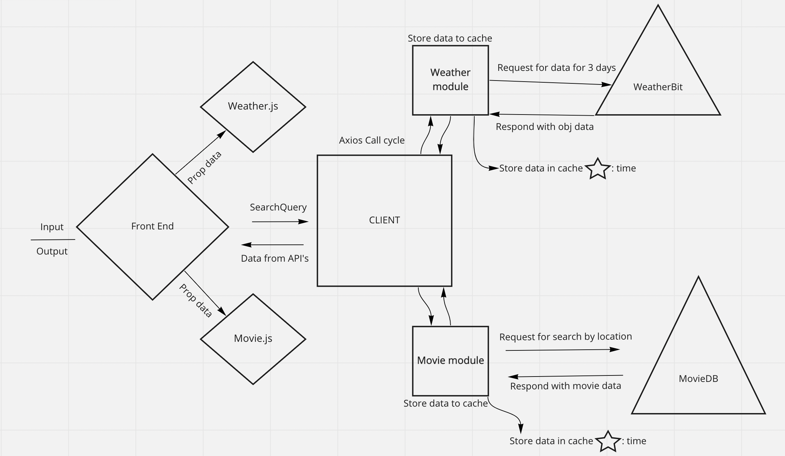

# city-explorer-lab08api

This project was bootstrapped by hand!

**Author**: Jon Rumsey
**Version**: 1.0.0

## Overview

Build an Express server that uses Axios library to make API requests for data to 3rd party APIs on behalf of a front end React client.

## Getting Started

1. Clone this repository to your local.  
2. Update node_modules with `npm install`  
3. Open `.env.sample`, make appropriate edits to the API Key entries with your own API Keys and save it as `.env`  
4. Install 'nodemon' and run it so the server will auto-restart.  

## Architecture

  
  
  
  

## Change Log

21-Apr-22 2200 PDT - Completed building server, testing, and also refactored routes to use modularized Weather and Movies functions, and added error handling.  
20-Apr-22 2300 PDT - Completed scaffolding server and heroku.  

## Credit and Collaborations

WRRC Diagrams, workflows, wireframes, and pair programming:  
Darius Owens [GitHub](https://github.com/DariusO92)  
Gina Napier [GitHub](https://github.com/gina305)  
Stan Wilder [GitHub](https://github.com/stanwilder)  
Scott Evans [GitHub](https://github.com/mScottEvans)  
Kyle Honaker [GitHub](https://github.com/ikyle53)  

## Resources

Express [Error Handling](https://expressjs.com/en/guide/error-handling.html)  
